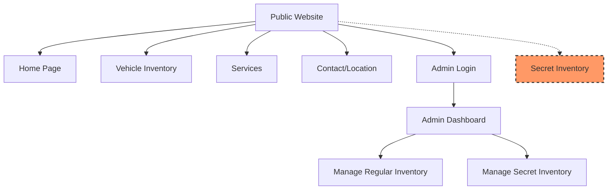
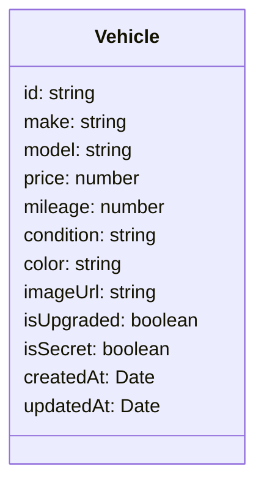

# Mosley Auto Website Implementation Plan

## Project Overview

**Purpose:** Create a website for Mosley Auto (GTA V roleplay) that showcases:
- Vehicle inventory (regular and "stolen" secret inventory)
- Services offered (towing, repairs, etc.)
- Location information

**Technical Stack:**
- Next.js (frontend framework)
- Vercel (hosting)
- Custom authentication for admin access

**Design Requirements:**
- Early 2000s sleazy car dealership aesthetic
- "Paint on the Wall" font for Mosley Auto headings (red color)
- Blue accent color
- Roboto font for general copy
- Animated elements and flashy colors typical of early 2000s websites
- Star burst elements with "SALE!" text

## Site Architecture



*Note: The dashed line to Secret Inventory indicates it's accessible via a Konami-code style keyboard sequence from any page.*

## Database Schema

### Vehicle Model



## Implementation Plan

### Phase 1: Project Setup and Basic Structure

1. **Initialize Next.js Project**
   - Set up a new Next.js project
   - Configure project structure
   - Install necessary dependencies

2. **Font and Style Setup**
   - Import "Paint on the Wall" font from assets
   - Set up global styles with the required color scheme
   - Create base components with the early 2000s aesthetic
   - Implement animated elements and star burst components

3. **Basic Page Structure**
   - Create layout components
   - Implement header with Mosley Auto logo
   - Create navigation menu
   - Implement footer with contact information

### Phase 2: Vehicle Inventory Management

1. **Vehicle Data Structure**
   - Create models for vehicle data
   - Implement functions to store and retrieve vehicle data
   - Set up filtering and sorting capabilities

2. **Admin Authentication**
   - Implement password-protected admin login
   - Create secure sessions for admin users
   - Set up route protection for admin pages

3. **Admin Interface**
   - Create admin dashboard
   - Implement form for adding/editing vehicles with image URL field
   - Add checkbox for marking vehicles as "secret" inventory
   - Add checkbox for marking vehicles as "upgraded"
   - Implement vehicle deletion functionality

### Phase 3: Public-Facing Pages

1. **Home Page**
   - Create hero section with flashy dealership messaging
   - Implement featured vehicles section
   - Add services overview
   - Include location information

2. **Vehicle Inventory Page**
   - Display all regular inventory vehicles
   - Implement filtering and sorting options
   - Create individual vehicle detail views
   - Add visual indicator for upgraded vehicles

3. **Secret Inventory Page**
   - Implement Konami-code style keyboard sequence detector (accessible from any page)
   - Create password prompt after successful code entry
   - Display stolen vehicles after successful authentication
   - Implement similar functionality as regular inventory

4. **Services Page**
   - List all services with prices:
     - Car tow: $800
     - Repairs in store: $500
     - Mobile Repairs: $700
     - Tyre replacement: $250
     - Ignition replacement: $1500
     - Spray paint car: $750
   - Add descriptions and images for each service

5. **Contact/Location Page**
   - Display address (corner of Carson and Strawberry, opposite the mega mall)
   - Add interactive map or image of location
   - Include contact information

### Phase 4: Styling and Early 2000s Aesthetic

1. **Implement Visual Elements**
   - Create star burst components with "SALE!" text
   - Add animated elements (blinking text, moving graphics)
   - Implement flashy color schemes and gradients

2. **Typography**
   - Use "Paint on the Wall" font for all Mosley Auto headings (in red)
   - Implement Roboto font for general copy
   - Create stylized text elements typical of early 2000s websites

3. **Responsive Design**
   - Ensure website works on different screen sizes
   - Maintain the early 2000s aesthetic across devices

### Phase 5: Deployment and Testing

1. **GitHub Repository Setup**
   - Initialize Git repository
   - Create README with project information
   - Set up GitHub workflow for Vercel deployment

2. **Vercel Deployment**
   - Connect GitHub repository to Vercel
   - Configure environment variables
   - Set up automatic deployments

3. **Testing**
   - Test all functionality
   - Verify admin interface works correctly
   - Ensure vehicle data is properly stored and retrieved
   - Test secret inventory access with Konami code

## Technical Implementation Details

### Secret Inventory Access

The secret inventory will be accessible through a Konami-code style keyboard sequence:

```javascript
// Example implementation of Konami code detector
const konamiCode = ['ArrowUp', 'ArrowUp', 'ArrowDown', 'ArrowDown', 'ArrowLeft', 'ArrowRight', 'ArrowLeft', 'ArrowRight', 'b', 'a'];
let konamiIndex = 0;

const handleKeyDown = (e) => {
  // Check if the key pressed matches the next key in the sequence
  if (e.key === konamiCode[konamiIndex]) {
    konamiIndex++;
    
    // If the full sequence is entered, show the password prompt
    if (konamiIndex === konamiCode.length) {
      showSecretInventoryPrompt();
      konamiIndex = 0; // Reset the index
    }
  } else {
    konamiIndex = 0; // Reset on incorrect sequence
  }
};

// Add the event listener to the document
useEffect(() => {
  document.addEventListener('keydown', handleKeyDown);
  
  return () => {
    document.removeEventListener('keydown', handleKeyDown);
  };
}, []);
```

After the correct sequence is entered, a password prompt will appear. Upon entering the correct password, the user will be redirected to the secret inventory page.

### Admin Authentication

The admin interface will be protected by a simple password authentication system:

1. **Login Page**
   - Create a login form with password field
   - Implement client-side validation

2. **Authentication API**
   - Create an API route to handle authentication
   - Verify password against stored value
   - Create a secure session for authenticated users

3. **Protected Routes**
   - Create middleware to protect admin routes
   - Redirect unauthenticated users to the login page

### Vehicle Data Management

Vehicle data will be stored using a JSON-based approach:

1. **Data Structure**
   - Store vehicle details in a structured format
   - Separate regular and secret inventory
   - Include all required fields (make, model, price, etc.)
   - Store image URLs pointing to in-game screenshots

2. **API Routes**
   - Create API routes for CRUD operations on vehicles
   - Implement filtering and sorting functionality
   - Ensure only authenticated users can modify data

## Implementation Timeline

This project is designed to be implemented by an AI bot in a single day. The implementation should follow these phases in order:

1. **Morning (0-3 hours)**: Project setup, font/style configuration, and basic structure
2. **Mid-day (3-6 hours)**: Vehicle data management, admin interface, and authentication
3. **Afternoon (6-9 hours)**: Public-facing pages, secret inventory access, and styling
4. **Evening (9-12 hours)**: Final touches, testing, and deployment

## Key Features Checklist

- [ ] Next.js project setup with proper directory structure
- [ ] "Paint on the Wall" font integration for Mosley Auto headings
- [ ] Early 2000s sleazy car dealership aesthetic
- [ ] Admin login with password protection
- [ ] Vehicle inventory management (add, edit, delete)
- [ ] Regular vehicle inventory display
- [ ] Secret inventory with Konami code access
- [ ] Services page with pricing
- [ ] Location information
- [ ] Responsive design
- [ ] GitHub repository setup
- [ ] Vercel deployment

## Additional Notes

1. **Image Handling**: Vehicle images will be added via URLs to in-game screenshots, not uploaded files.

2. **Secret Inventory**: The secret inventory should be completely hidden from regular users and only accessible via the Konami code sequence followed by a password.

3. **Admin Interface**: Keep the admin interface simple but functional, focusing on the ability to easily add, edit, and remove vehicles from both regular and secret inventories.

4. **Early 2000s Aesthetic**: Embrace the "shitty sleazy car dealership" style with flashy colors, animated elements, and star burst "SALE!" graphics.